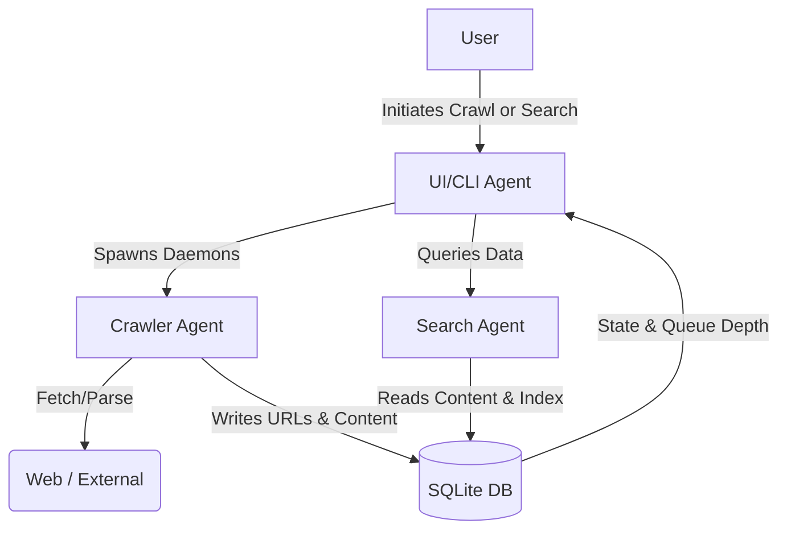

# Multi-Agent Workflow

This document explains the multi-agent AI collaboration process used to design and build this project. The system was constructed not by a single programmer, but rather through the coordinated efforts of four specialized AI agents.

## The Agent Team

1.  **System Architect Agent**
    *   **Responsibility:** Designs the core database schema, the concurrent synchronization mechanisms, and the back-pressure model required for the indexing queue.
    *   **Focus Area:** Scalability (on a single machine), data persistence, state-recovery (resumability).
2.  **Indexer & Crawler Agent**
    *   **Responsibility:** Implements the web scraping logic. Visits URLs up to a specific job's max depth (`max_depth`), propagates the exact seed `origin_url` to its children, and proactively halts appending to the queue if the back-pressure queue limit is reached to avoid memory bursts.
3.  **Search Engine Agent**
    *   **Responsibility:** Implements the query engine. Converts user queries into keywords, calculates relevancy scores by tallying exact keyword overlap frequencies in the text, and returns ranked `(relevant_url, origin_url, depth)` triples.
4.  **UI/CLI Agent**
    *   **Responsibility:** Builds the interactive interface bridging the human user and the underlying crawling/search tasks. It provides live progress feeds, queues depth feedback, and error handling.

## Interaction Workflow

The development and architectural workflow occurred in distinct phases, managed cooperatively:

### Phase 1: Planning and Architecture (Architect & All)
*   **Drafting:** The Architect Agent proposed using `sqlite3` built-in features to serve as the unified state container. This allows the Crawler Agent to write data safely while the Search Engine Agent concurrently reads data without relying on heavy third-party databases.
*   **Decisions:** A unified threaded approach was chosen to respect "native capabilities" instead of `asyncio`, as `sqlite3` natively pairs well with threads for synchronous locks. 

### Phase 2: Implementation Setup (Crawler & Architect)
*   **Action:** The Architect Agent created the DB schema with two tables: `urls` (holds crawler state, depth, and origins) and `content_index` (holds scraped content).
*   **Action:** The Crawler Agent utilized Python's native `urllib.request` and `html.parser`. It actively yields before queueing links if `pending` jobs exceed `MAX_QUEUE_DEPTH` (Back-pressure logic check prior to insert). It propagates the `max_depth` parameter job-by-job.

### Phase 3: Continual Search & Ranking (Search & UI)
*   **Action:** The Search agent generates dynamic `score` counters scaling with the occurrences of keywords in `c.text_content`, returning ordered ranked tuples instead of pure boolean matched sets.
*   **Action:** The UI Agent integrated Python's runtime memory to start the crawling threads as background daemons. The UI Agent then exposed a CLI that accepts human inputs while the crawler threads actively write to DB.

### Phase 4: Refinement and Evaluation
*   All agents provided their code modules which the team lead (the orchestrator) combined into the final `main.py`. The interface was continuously refined by the UI Agent to ensure queue depth visibility and clear output for relevant search triplets.

## Flow Diagram

